# [methods.py](methods.py)
### activation

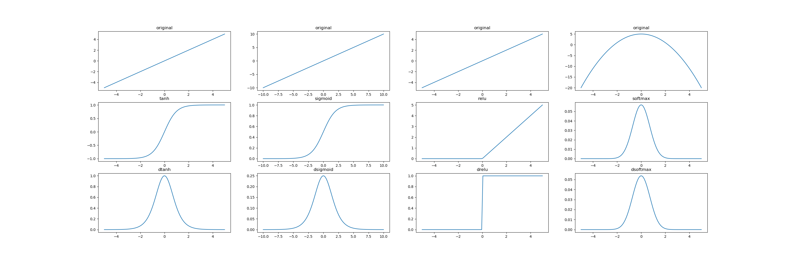

### loss

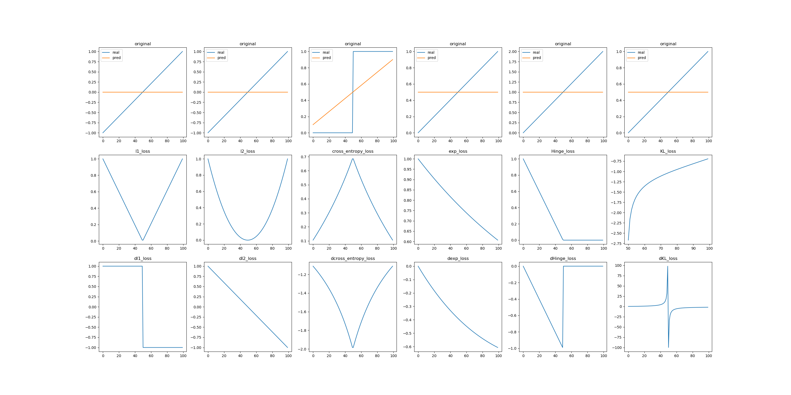

### normalization

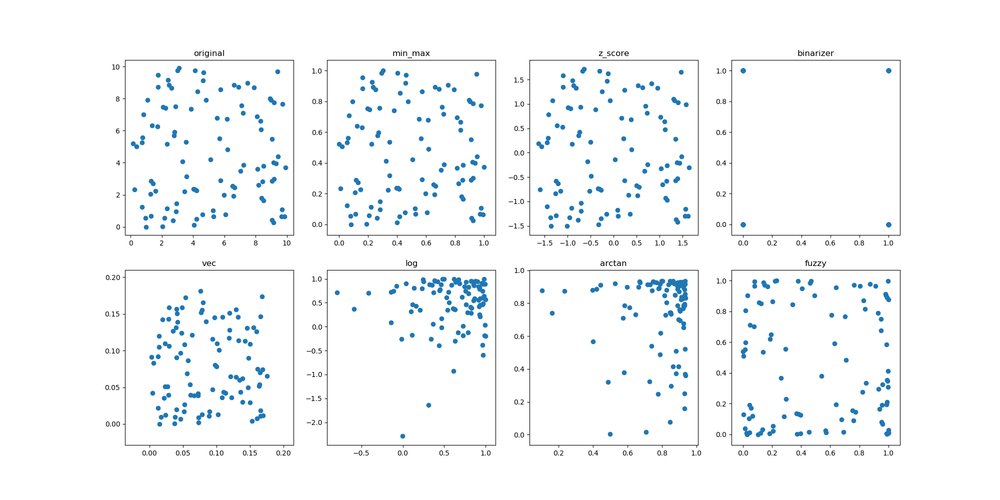

### optimizer

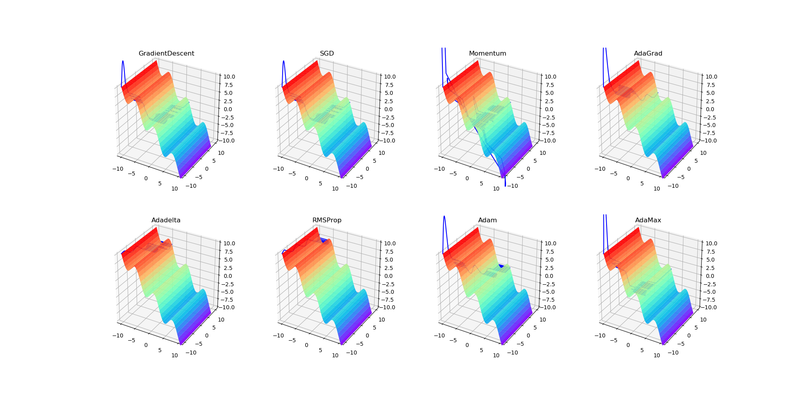

# DNN
### [np_dnn.py](np_dnn.py)
### [tf_dnn.py](tf_dnn.py)
### [keras_dnn.py](keras_dnn.py)

| dnn_1_4_4_1 | dnn_1_8_8_1 |
| :----: | :----: |
|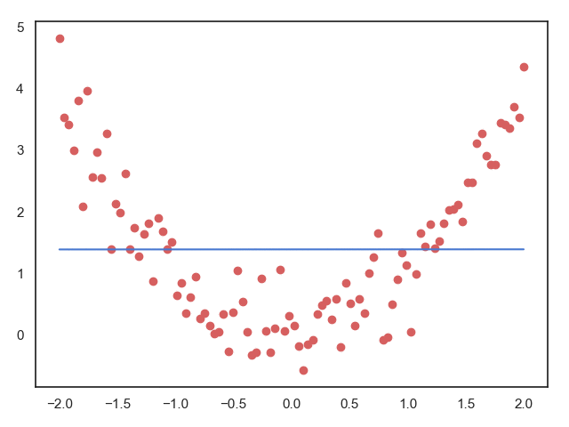|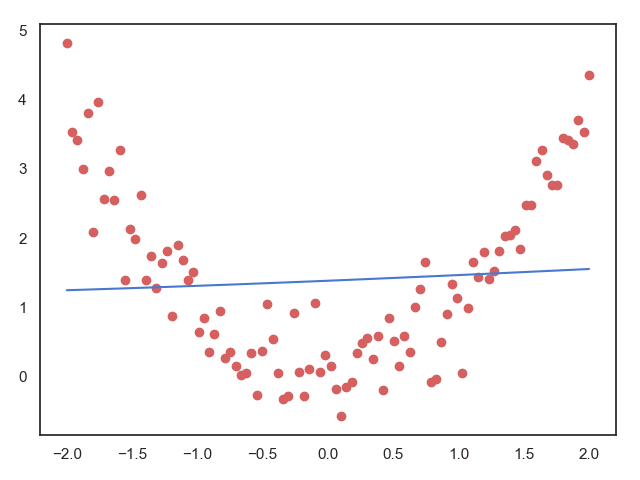|
| tf_dnn_1_4_4_1 | keras_dnn_1_4_4_1 |
|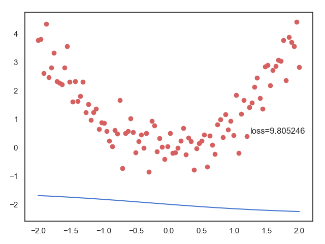|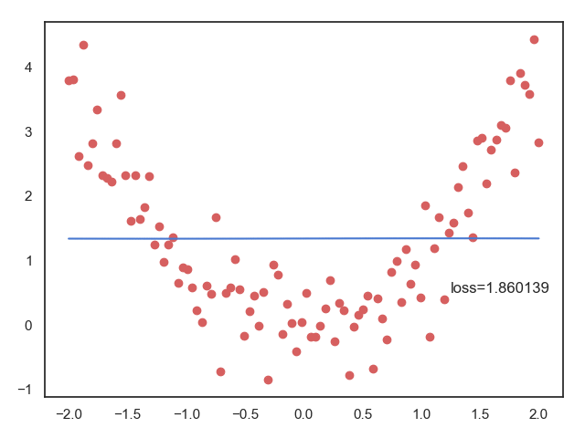|

# RNN
### [np_rnn.py](np_rnn.py)
### [tf_rnn.py](tf_rnn.py)
### [keras_rnn.py](keras_rnn.py)

| rnn_less_iter | rnn_more_iter |
| :----: | :----: |
|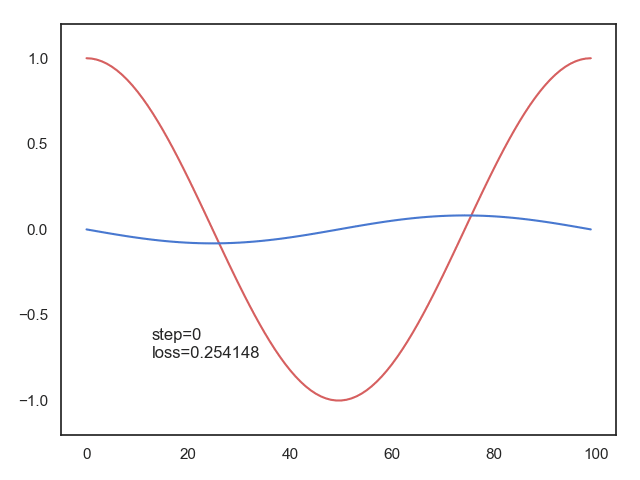||
| tf_rnn | keras_rnn |
|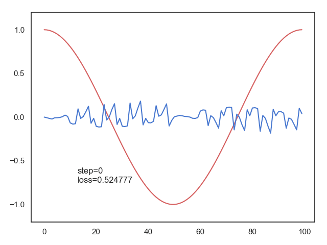|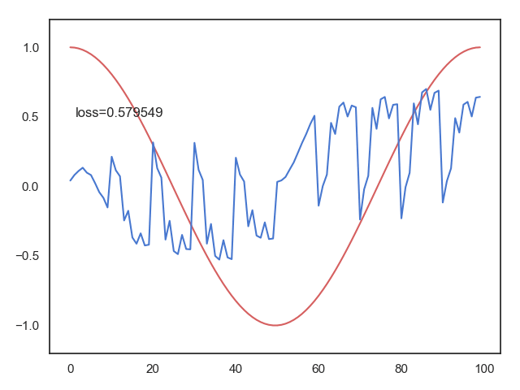|

# CNN
### [np_cnn.py](np_cnn.py)
### [tf_cnn.py](tf_cnn.py)
### [keras_cnn.py](keras_cnn.py)

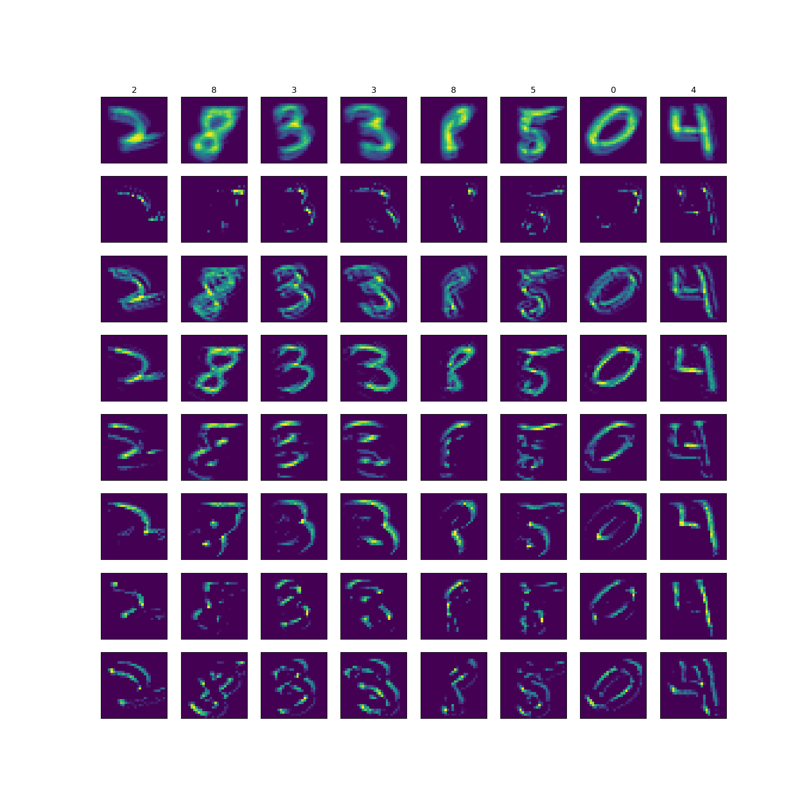